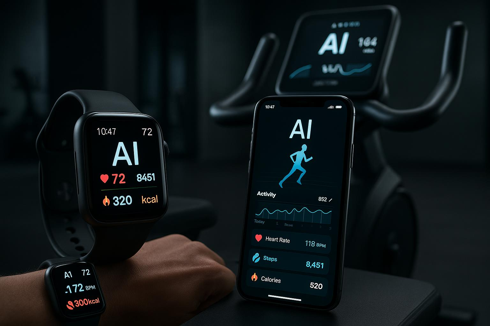

# 🏋️ IA Fitness Coach: Natty or Not?



## 📒 Descrição

Este projeto explora o fascinante mundo das **IAs Generativas** através do conceito "Natty or Not" do fisiculturismo, aplicado à criação de conteúdo digital. Inspirado no desafio da Digital Innovation One (DIO), desenvolvemos um projeto completo que demonstra o poder das IAs em gerar conteúdo hiper-realista, desde imagens fotográficas até textos técnicos e websites interativos.

O conceito central questiona: **"Este conteúdo é real ou foi gerado por Inteligência Artificial?"** - uma pergunta cada vez mais relevante na era digital em que vivemos.

## 🤖 Tecnologias Utilizadas

Este projeto foi desenvolvido utilizando um conjunto robusto de tecnologias de IA e desenvolvimento web:

### Inteligência Artificial
- **DALL-E 3**: Geração de imagens fotorrealistas com prompts detalhados e técnicas avançadas
- **GPT-4**: Criação de conteúdo textual profissional, estruturação do e-book e documentação
- **Claude**: Assistência na revisão e refinamento do conteúdo técnico

### Desenvolvimento Web
- **HTML5**: Estruturação semântica do website
- **CSS3**: Estilização moderna com gradientes, animações e design responsivo
- **JavaScript**: Interatividade, efeitos visuais e experiência do usuário aprimorada

### Ferramentas e Plataformas
- **Markdown**: Formatação do e-book e documentação
- **Git/GitHub**: Versionamento de código e hospedagem do projeto
- **GitHub Pages**: Deploy do website (configurável)

## 🧐 Processo de Criação

O desenvolvimento deste projeto seguiu uma metodologia estruturada em 5 etapas principais:

### 1. Conceituação e Planejamento
Iniciamos com a definição do conceito "Natty or Not" aplicado às IAs Generativas. A ideia era criar um projeto que não apenas demonstrasse as capacidades técnicas das IAs, mas que também provocasse reflexão sobre autenticidade e criatividade na era digital. Escolhemos o tema fitness por sua conexão direta com o termo "Natty or Not" e por ser um campo onde a transformação visual é altamente valorizada.

### 2. Geração de Imagens com IA
Utilizamos técnicas avançadas de prompt engineering para criar 5 imagens hiper-realistas:
- **Transformação "Antes"**: Retrato de uma pessoa no início da jornada fitness
- **Transformação "Depois"**: Resultado atlético impressionante da mesma pessoa
- **Personal Trainer Virtual**: Coach profissional com tablet e equipamentos modernos
- **Academia High-Tech**: Ambiente futurista com iluminação LED e equipamentos de ponta
- **Tecnologia Fitness**: Wearables e aplicativos de IA em ação

Cada imagem foi gerada com prompts detalhados que especificavam iluminação, composição, estilo fotográfico e detalhes anatômicos para garantir o máximo realismo.

### 3. Produção do E-book
Criamos um e-book completo de 5 capítulos sobre "Transformação 4.0: O Guia Definitivo do Fitness com IA". O conteúdo aborda:
- Personal trainers virtuais e treinamento hiper-personalizado
- Nutrição de precisão com algoritmos de IA
- O desafio "Natty or Not" na era digital
- Ferramentas e tecnologias do Fitness 4.0
- Reflexões sobre o futuro do fitness

O e-book foi formatado em Markdown e convertido para PDF, integrando as imagens geradas por IA ao longo do texto.

### 4. Desenvolvimento do Website
Desenvolvemos um website interativo com design **minimalista e clean**, seguindo as melhores práticas de UX/UI:
- **Hero Section**: Título impactante com efeito glitch e gradientes vibrantes
- **Galeria Interativa**: Showcase das imagens geradas por IA com overlays informativos
- **Timeline do Processo**: Visualização clara das etapas de criação
- **Seção de Reflexão**: Pensamentos sobre autenticidade e criatividade com IA
- **Design Responsivo**: Totalmente adaptável a dispositivos móveis

O website inclui animações suaves, efeitos de parallax e transições que criam uma experiência moderna e profissional.

### 5. Documentação e Organização
Finalizamos com a criação de documentação completa, incluindo este README detalhado, organização da estrutura de pastas e preparação para deploy no GitHub Pages.

## 🚀 Resultados

O projeto entrega um portfólio completo e multifacetado:

### 📸 Galeria de Imagens (100% IA)
Todas as 5 imagens do projeto foram geradas por Inteligência Artificial e apresentam qualidade fotorrealista impressionante. É praticamente impossível distingui-las de fotografias reais sem uma análise técnica detalhada.

**Visualize a galeria completa em:** `assets/images/`

### 📚 E-book Profissional
Um guia completo de 15+ páginas sobre IA e Fitness, disponível em formato Markdown e PDF. O conteúdo é técnico, bem estruturado e educativo, servindo como material de referência real sobre o tema.

**Download:** [ebook.pdf](ebook.pdf)

### 🌐 Website Interativo
Landing page moderna e responsiva que apresenta o projeto de forma profissional e envolvente. O site pode ser facilmente hospedado no GitHub Pages.

**Acesse:** `website/index.html`

### 📂 Repositório Organizado
Estrutura de arquivos limpa e bem documentada, pronta para ser apresentada em portfólios profissionais e entrevistas técnicas.

## 💭 Reflexão: O Desafio de Criar Algo "Natty" com IA

Criar algo verdadeiramente "natty" (natural) com IA é um paradoxo fascinante. Por um lado, a tecnologia nos permite gerar conteúdo que é indistinguível do real. Por outro, há uma questão filosófica profunda sobre autenticidade e criatividade.

### O Que Aprendi

**1. A IA Amplifica, Não Substitui**  
A Inteligência Artificial é uma ferramenta poderosa, mas cada decisão criativa, cada prompt, cada escolha de design foi guiada por intenção humana. A IA executou, mas o conceito, a visão e o propósito vieram de mim.

**2. Prompt Engineering é uma Arte**  
Criar imagens fotorrealistas não é simplesmente digitar "pessoa na academia". Requer compreensão de composição fotográfica, iluminação, anatomia e técnica. Os prompts mais eficazes são extremamente detalhados e técnicos.

**3. Ética e Transparência São Essenciais**  
Em um mundo onde IA pode criar conteúdo tão convincente, a transparência sobre o que é gerado por IA e o que é real torna-se uma responsabilidade ética. Este projeto deixa claro que todo o conteúdo visual foi gerado artificialmente.

**4. O Futuro é Híbrido**  
O verdadeiro poder não está em escolher entre "humano" ou "IA", mas em combinar o melhor de ambos. A criatividade humana direcionando a capacidade de execução da IA cria resultados que nenhum dos dois poderia alcançar sozinho.

### A Resposta ao "Natty or Not"

Este projeto **não é "natty"** no sentido tradicional - utilizamos IA extensivamente. Mas é **100% autêntico** em termos de criatividade, propósito e execução. A IA foi a ferramenta, mas a visão e o trabalho foram genuinamente humanos.

O verdadeiro desafio "Natty or Not" da era digital não é sobre se usamos IA, mas sobre **como** a usamos: de forma ética, criativa, transparente e com propósito genuíno.

## 📁 Estrutura do Projeto

```
lab-natty-or-not/
├── assets/
│   └── images/
│       ├── fitness-transformation-before.jpg
│       ├── fitness-transformation-after.jpg
│       ├── ai-personal-trainer.jpg
│       ├── modern-gym-environment.jpg
│       └── ai-fitness-technology.jpg
├── website/
│   ├── index.html
│   ├── style.css
│   └── script.js
├── ebook.md
├── ebook.pdf
├── README.md
└── PLANEJAMENTO.md
```

## 🎯 Como Visualizar o Projeto

### Visualizar o Website Localmente
1. Clone este repositório:
```bash
git clone https://github.com/MarcioGil/lab-natty-or-not.git
```

2. Navegue até a pasta do website:
```bash
cd lab-natty-or-not/website
```

3. Abra o arquivo `index.html` em seu navegador

### Deploy no GitHub Pages
1. Acesse as configurações do repositório no GitHub
2. Vá em **Settings > Pages**
3. Em **Source**, selecione a branch `main` e a pasta `/ (root)`
4. Aguarde alguns minutos e acesse: `https://marciogil.github.io/lab-natty-or-not/website/`

## 🔗 Links Úteis

- [Digital Innovation One](https://www.dio.me)
- [Desafio Original](https://github.com/digitalinnovationone/lab-natty-or-not)
- [Base10: Generative AI Trend Map](https://base10.vc/post/generative-ai-mission-critical/)

## 👨‍💻 Autor

**Márcio Gil**

Desenvolvedor apaixonado por tecnologia e inovação, explorando as fronteiras da Inteligência Artificial e suas aplicações práticas.

- GitHub: [@MarcioGil](https://github.com/MarcioGil)
- Projeto: [lab-natty-or-not](https://github.com/MarcioGil/lab-natty-or-not)

## 📜 Licença

Este projeto foi desenvolvido para fins educacionais como parte do desafio "Natural ou Fake Natty?" da DIO.

---

## 🏷️ Hashtags

#LabDIONattyOrNot #IAGenerativa #Fitness40 #InteligenciaArtificial #DIO #TechInnovation

---

<div align="center">

**⭐ Se você gostou deste projeto, deixe uma estrela no repositório!**

*Desenvolvido com 💚 e muita IA por Márcio Gil*

</div>

