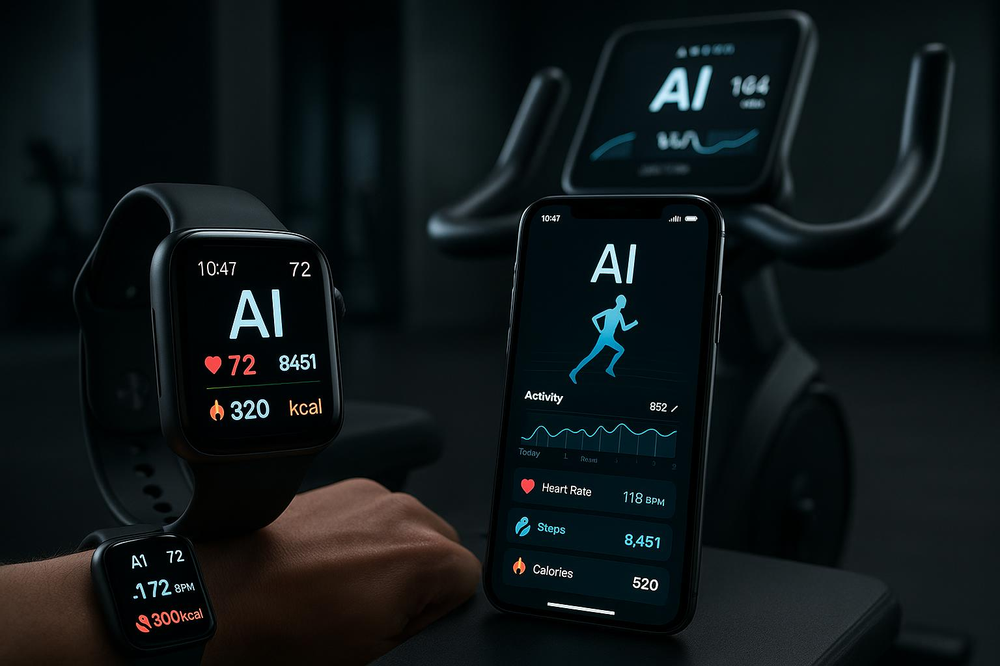

# Transformação 4.0: O Guia Definitivo do Fitness com IA

## Introdução: A Revolução da Inteligência Artificial no Fitness

A indústria do fitness está à beira de uma transformação monumental, impulsionada por uma das tecnologias mais disruptivas do nosso tempo: a **Inteligência Artificial (IA)**. Longe de ser um conceito de ficção científica, a IA já está redefinindo a maneira como nos exercitamos, nos alimentamos e monitoramos nossa saúde. Este e-book é o seu guia completo para entender e aproveitar o poder da IA em sua jornada de fitness, mostrando como essa tecnologia pode levar seus resultados a um nível totalmente novo.

Esqueça as abordagens genéricas e os planos de treino "tamanho único". A IA promete um futuro de **hiper-personalização**, onde cada aspecto da sua rotina de fitness é adaptado às suas necessidades, objetivos e biometria únicos. Desde personal trainers virtuais que ajustam seus treinos em tempo real até nutricionistas digitais que criam planos alimentares perfeitamente balanceados, as possibilidades são vastas e empolgantes.

Neste guia, exploraremos o que há de mais moderno em tecnologia de fitness com IA, desmistificando os conceitos e mostrando aplicações práticas que você pode começar a usar hoje. Prepare-se para descobrir como a IA pode ser sua maior aliada na busca por uma vida mais saudável, forte e equilibrada. A revolução do fitness 4.0 já começou. Você está pronto para fazer parte dela?

## Capítulo 1: O Personal Trainer Virtual - Treinamento Hiper-Personalizado com IA

A era dos planos de treino genéricos está com os dias contados. A Inteligência Artificial está inaugurando uma nova fase no condicionamento físico: o **treinamento hiper-personalizado**. Utilizando algoritmos avançados, os personal trainers virtuais baseados em IA podem analisar uma vasta gama de dados para criar programas de exercícios que são exclusivamente seus.

### Como Funciona?

Esses sistemas inteligentes coletam informações de várias fontes:

- **Dados Biométricos:** Frequência cardíaca, qualidade do sono, níveis de estresse e até mesmo a variabilidade da frequência cardíaca (VFC) são monitorados por wearables como smartwatches e anéis inteligentes.
- **Feedback de Desempenho:** A IA analisa sua performance em cada exercício, ajustando a carga, o volume e a intensidade em tempo real para otimizar seus resultados e prevenir lesões.
- **Objetivos e Preferências:** Seus objetivos específicos, sejam eles perda de peso, ganho de massa muscular ou melhora de performance atlética, são o ponto de partida para a criação do seu plano.

Com base nesses dados, a IA não apenas prescreve exercícios, mas também aprende e se adapta continuamente. Se você teve uma noite de sono ruim, por exemplo, seu treinador virtual pode sugerir um treino mais leve para evitar o overtraining. Se você está progredindo rapidamente em um determinado exercício, a IA pode aumentar o desafio para garantir que você continue evoluindo.

Essa abordagem dinâmica e baseada em dados garante que cada sessão de treino seja maximamente eficaz, segura e perfeitamente alinhada com o seu estado físico e mental do dia.

## Capítulo 2: Nutrição de Precisão - A Dieta do Futuro é Calculada por IA

Uma nutrição adequada é responsável por uma parcela significativa dos resultados de qualquer programa de fitness. No entanto, a complexidade de criar um plano alimentar verdadeiramente personalizado pode ser um grande desafio. A Inteligência Artificial está simplificando esse processo, oferecendo **nutrição de precisão** em uma escala sem precedentes.

### A Ciência por Trás da Dieta Inteligente

Nutricionistas digitais baseados em IA utilizam algoritmos para processar uma enorme quantidade de informações e criar planos alimentares otimizados:

- **Análise de Perfil:** A IA considera seu peso, altura, idade, sexo, nível de atividade física e metas de composição corporal.
- **Preferências e Restrições:** Suas preferências alimentares, alergias, intolerâncias e restrições dietéticas (vegetariano, vegano, etc.) são incorporadas ao plano.
- **Metabolismo e Genética:** Em um futuro próximo, a IA poderá analisar dados do seu metabolismo e até mesmo informações genéticas para otimizar a dieta em um nível celular.

O resultado é um plano alimentar dinâmico que não apenas informa *o que* comer, mas também *quando* e *quanto*. A IA pode ajustar suas recomendações com base no seu treino do dia, garantindo que você tenha a energia necessária para a performance e os nutrientes corretos para a recuperação. Ferramentas de "computer vision" já permitem que você simplesmente tire uma foto da sua refeição para que a IA analise os macronutrientes e calorias, tornando o rastreamento mais fácil do que nunca.

## Capítulo 3: O Desafio "Natty or Not" na Era da IA

O termo "Natty or Not" (Natural ou Não), popular no mundo do fisiculturismo, questiona se a transformação física de um indivíduo foi alcançada de forma natural ou com o auxílio de substâncias para melhora de performance. Na era da Inteligência Artificial, este conceito ganha uma nova e fascinante dimensão: **o conteúdo que vemos é real ou gerado por IA?**

### A Prova de Conceito: Transformação Fotorrealista

Para ilustrar o poder das IAs Generativas, criamos um estudo de caso de uma transformação física. As imagens a seguir foram **100% geradas por Inteligência Artificial**. Elas não são de uma pessoa real.

**Antes:**

**Depois:**

A capacidade da IA de criar imagens tão realistas, com detalhes de pele, iluminação e anatomia, é o que torna este campo tão revolucionário. A linha entre o real e o digital está se tornando cada vez mais tênue, desafiando nossa percepção e abrindo um leque de possibilidades criativas e tecnológicas.

Este projeto serve como uma demonstração prática do quão convincente o conteúdo gerado por IA pode ser. O desafio "Natty or Not" não é mais apenas sobre o físico, mas sobre a autenticidade de toda a informação visual que consumimos.

## Capítulo 4: As Ferramentas do Fitness 4.0

A revolução do fitness com IA não seria possível sem um ecossistema robusto de ferramentas e tecnologias. Aqui estão as principais categorias de soluções que estão transformando o setor:

### Wearables Inteligentes

Os dispositivos vestíveis são os olhos e ouvidos da IA no mundo do fitness. Smartwatches, anéis inteligentes e até mesmo roupas com sensores integrados coletam dados biométricos continuamente. Esses dados alimentam os algoritmos de IA, permitindo insights profundos sobre sua saúde e performance.

### Aplicativos de Fitness com IA

Aplicativos móveis estão cada vez mais sofisticados, incorporando IA para oferecer coaching personalizado, análise de movimento através da câmera do smartphone e até mesmo reconhecimento de exercícios em tempo real. Alguns apps utilizam "computer vision" para corrigir sua postura durante os exercícios, funcionando como um personal trainer virtual de bolso.

### Equipamentos de Academia Conectados

Esteiras, bicicletas ergométricas e máquinas de musculação estão se tornando "inteligentes", conectando-se à internet e ajustando automaticamente a resistência e a intensidade com base em seus dados de treino e objetivos. Essas máquinas podem sincronizar com seu perfil de IA, garantindo uma experiência de treino fluida e otimizada.

### Plataformas de Análise de Dados

Plataformas especializadas agregam dados de múltiplas fontes (wearables, apps, equipamentos) e utilizam IA para gerar relatórios detalhados sobre seu progresso, identificar padrões e fazer previsões sobre seus resultados futuros. Essa visão holística é essencial para um planejamento estratégico de longo prazo.

## Capítulo 5: O Futuro do Fitness é Agora

O futuro do fitness não é uma promessa distante. Ele está acontecendo agora, impulsionado pela Inteligência Artificial. As tecnologias que exploramos neste e-book já estão disponíveis e acessíveis, prontas para transformar sua jornada de saúde e bem-estar.

### A Democratização do Fitness de Elite

Uma das maiores promessas da IA no fitness é a **democratização do acesso**. Serviços que antes eram exclusivos de atletas de elite e celebridades, como coaching personalizado 24/7 e análise biomecânica avançada, estão se tornando acessíveis a todos. A IA está nivelando o campo de jogo, permitindo que qualquer pessoa, independentemente de sua localização ou orçamento, tenha acesso a orientação de classe mundial.

### Desafios e Considerações Éticas

É importante reconhecer que, como qualquer tecnologia poderosa, a IA no fitness também apresenta desafios. Questões de **privacidade de dados** são primordiais, já que essas ferramentas coletam informações sensíveis sobre sua saúde. É fundamental escolher plataformas confiáveis que priorizem a segurança e a transparência no uso dos seus dados.

Além disso, a IA deve ser vista como uma ferramenta complementar, não um substituto completo para a orientação de profissionais de saúde qualificados. Sempre consulte médicos, nutricionistas e educadores físicos certificados, especialmente ao iniciar um novo programa de exercícios ou fazer mudanças significativas na sua dieta.

### Sua Jornada Começa Aqui

A transformação que você busca está ao seu alcance. Com a IA como sua aliada, você tem o poder de alcançar resultados que antes pareciam impossíveis. Comece hoje mesmo explorando as ferramentas e aplicativos disponíveis, e dê o primeiro passo rumo a uma versão mais saudável, forte e confiante de você mesmo.

O fitness 4.0 não é apenas sobre tecnologia. É sobre empoderamento, personalização e a busca incansável pela melhor versão de si mesmo. Seja bem-vindo ao futuro do fitness. Seja bem-vindo à sua transformação 4.0.

---

**Autor:** Márcio Gil  
**Projeto:** Lab Natty or Not - DIO  
**Data:** Outubro de 2025

---

## Referências e Recursos Adicionais

Este e-book foi criado como parte do desafio "Natural ou Fake Natty?" da Digital Innovation One (DIO), explorando o potencial das IAs Generativas para criar conteúdo realista e educativo.

**Tecnologias Utilizadas:**
- Geração de Imagens: IA Generativa (DALL-E 3)
- Redação e Estruturação: GPT-4
- Design e Formatação: Markdown + CSS

Para mais informações sobre IAs Generativas e suas aplicações, visite:
- [Digital Innovation One](https://www.dio.me)
- [Base10: Generative AI Trend Map](https://base10.vc/post/generative-ai-mission-critical/)

